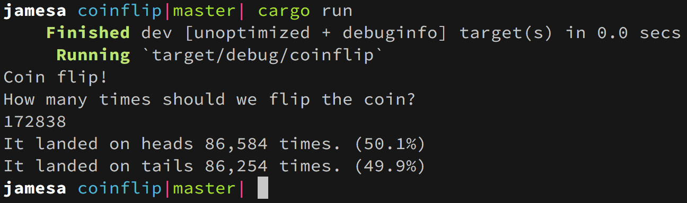

# Coin Flip 

Have you ever wanted to flip a coin but didn't have one on hand?

This :sparkles:very useful:sparkles: command line application will flip a coin not once, not twice,
but however many times you ask it to.

## Installing / Running
1. [Install Rust](https://www.rust-lang.org)
2. `git clone https://github.com/jamesa/coinflip.git`
3. `cd coinflip`
4. `cargo run`
